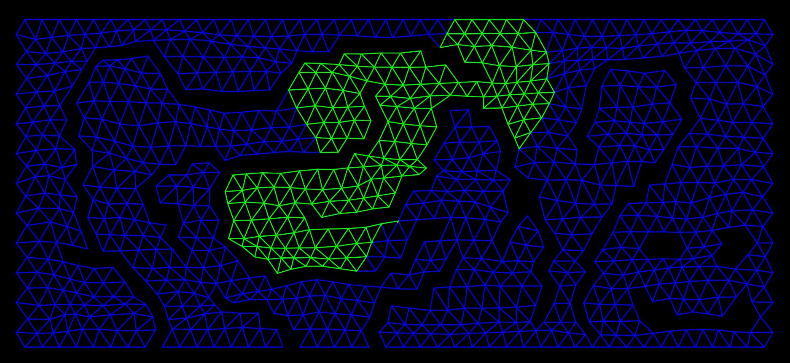

# Maze-solver

Maze generator with several built-in grid types, automatic distorsion using Perlin-noise and built-in DFS and BFS mazesolver algorithms.
You can draw a maze using your mouse, then start the graph traversal by pressing the space bar.

Example maze and a specific frame of the animation:

